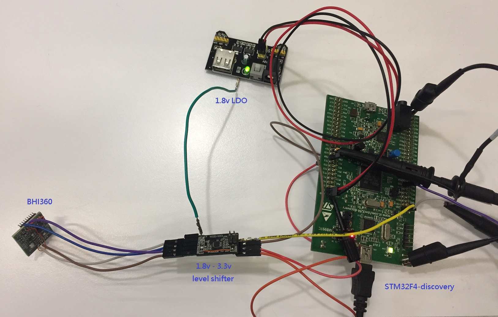
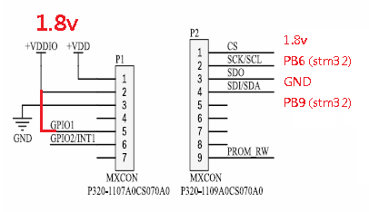
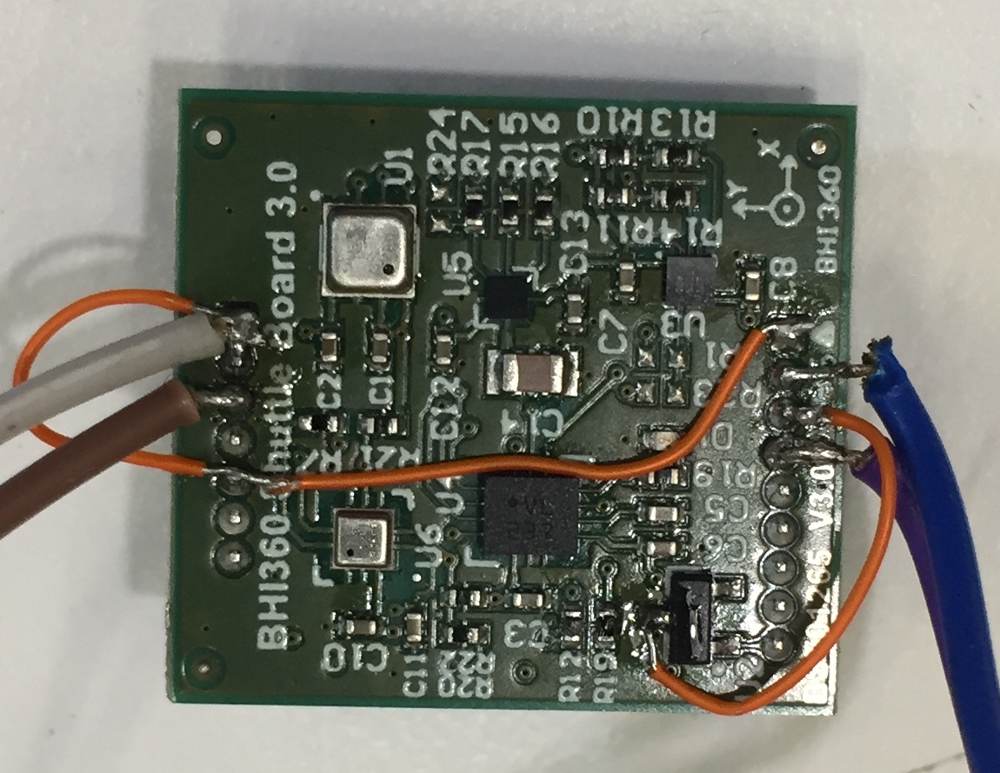
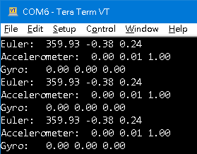

## Install STM32 tools
[STM32CubeMX](https://www.st.com/en/development-tools/stm32cubemx.html)  
[STM32CubeIDE](https://www.st.com/en/development-tools/stm32cubeide.html)  
[STM32CubeProgrammer](https://www.st.com/en/development-tools/stm32cubeprog.html)  

## Clone code
`git clone https://github.com/eiffelpeter/STM32F4-HAL-BHI360.git`  

## Connect STM32F4-Discovery and BHI360
  

## Pin connection for BHI360 shuttle board
  

  

## Build and Download
1. Open `STM32F4-HAL-BHI360.ioc` file in the STM32CubeMX and generate code.  
2. Open STM32CubeIDE and import by `Import Atollic TrueSTUDIO Project`.  
3. Open STM32CubeProgrammer and select `STM32F4-HAL-BHI360.hex` to Download.  
4. After Download, press STM32F4 reset button to run.  
5. LD4 LED blink when read sensors successfully.
6. Console [log](./Doc/log.txt) print tx at STM32 PA2 ( baud rate 115200 )  
  

## Reference
[STM32-HAL-BHI360](https://github.com/Dmivaka/STM32-HAL-BHI360/tree/main). This [document](./Doc/howto_build_STM32G4.docx) show howto build STM32G4.  
