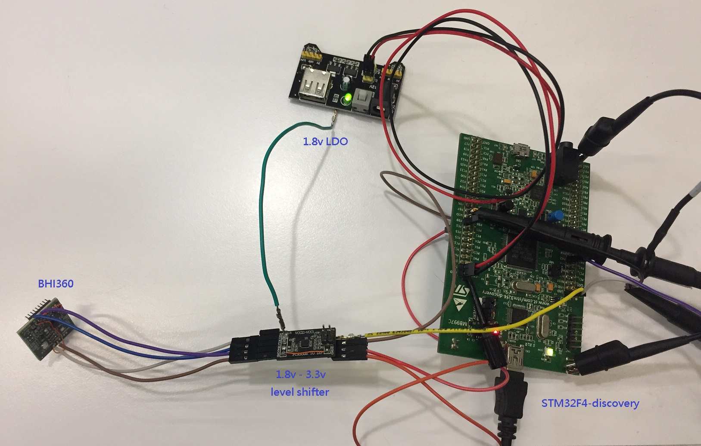
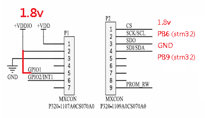

## Install STM32 tools 
[STM32CubeMX](https://www.st.com/en/development-tools/stm32cubemx.html)
[STM32CubeIDE](https://www.st.com/en/development-tools/stm32cubeide.html) 
[STM32CubeProgrammer](https://www.st.com/en/development-tools/stm32cubeprog.html)  

## Clone code
`git clone https://github.com/eiffelpeter/STM32F4-HAL-BHI360.git`

##  Hardware
STM32F4-discovery(STM32F4VGT6) board + Bosch BHI360

## Connect stm32f4-discovery and bhi360

## Pin connection for test

## console log 
printf at STM32 PA2 ( baud rate 115200 )
[log](./img/log.txt)  

## Build and Download
Open STM32F4-HAL-BHI360.ioc file in the STM32CubeMX and generate code. 
Open STM32CubeIDE and import this folder by `Import Atollic TrueSTUDIO Project'
Open STM32CubeProgrammer and select `STM32F4-HAL-BHI360.hex` to Download
After Download, press reset button to run.

## Reference
[STM32-HAL-BHI360](https://github.com/Dmivaka/STM32-HAL-BHI360/tree/main) 
